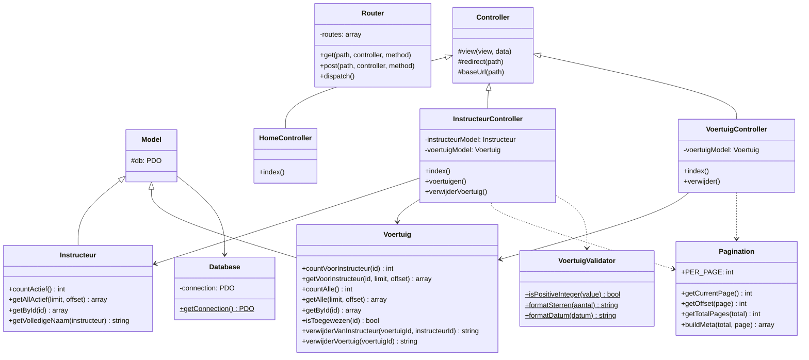

# Class Diagram - BE Opdracht 8

## Relaties

| Klasse | Relatie | Doel |
|--------|---------|------|
| Controllers | extends | Controller (basis MVC) |
| Models | extends | Model (PDO toegang) |
| Controllers | uses | Models, Pagination, VoertuigValidator |
| Database | singleton | PDO connectie |
