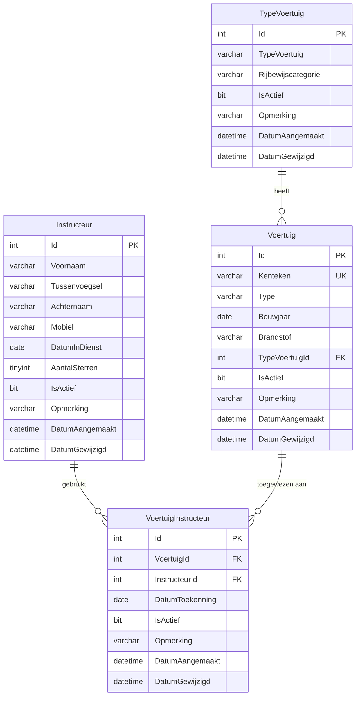

# ERD - Entity Relationship Diagram

## Kardinaliteit

- Eén **TypeVoertuig** kan meerdere **Voertuigen** hebben (1:N)
- Eén **Instructeur** kan meerdere **VoertuigInstructeur** koppelingen hebben (1:N)
- Eén **Voertuig** kan via **VoertuigInstructeur** aan één instructeur tegelijk gekoppeld zijn (N:1 via koppeltabel)
